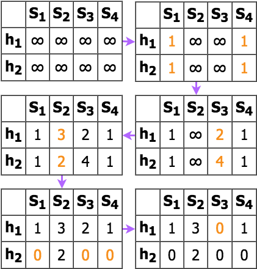

# Provider Prescriber
This repo contains the documentation for my final capstone project at [Galvanize](https://www.galvanize.com/denver-platte/data-science#curriculum). The goal of this project is to effectively combine my programming and data science toolbox to demonstrate my analytical and critical thinking skills.

## Background
Healthcare providers are diverse and current information systems don’t always contain the most effective filters to find similar providers. Each healthcare provider is considered to have a unique NPI with exception for cases of fraud. What is an NPI? An NPI (National Provider Identifier) is a 10-digit intelligence-free numeric identifier that is given to each healthcare provider and organization.

There are many possible business use cases for this study, however, the ones I feel would be most pertinent include provider recommendations for:
* Pharmaceutical representatives selling specialty products to similar providers
* Patients that have changed insurance plans and are looking for a similar provider

 

The public dataset (6GB) is available for download from [CMS](https://www.cms.gov/Regulations-and-Guidance/Administrative-Simplification/NationalProvIdentStand/DataDissemination.html). The current database has over 5 million entries and 328 available descriptor fields for each NPI. The BIGgest challenge in this study is working with BIG data. The method is straightforward but the computing resources must be optimized. Features used in this study include: entity type, gender, state of business location, specialties, credentials, sole proprietor status, and organizational subpart status.

## Objective
Provide the top 10 most similar providers given a specific National Provider Identifier (NPI).
* Minimum Viable Product: compute similarity on subset of data
* Stretch Goal 1: Scale model to compute similarity on entire dataset
* Stretch Goal 2:  Account for monthly and weekly data updates

## Process Overview and Flow
Below is a summary of the process steps which begins with data exploration and data munging. The model requires that the input be transformed into binary vectors which was done by parsing the csv in Python. Next, I used Apache Spark's implementation of MinHash LSH to take advantage of distributed computing to evaluate many parallel similarity calculations. The PySpark script was executed on an AWS virtual machine for additional computing power and resources. The output csv was uploaded to a Postgres database where it is available to be queried by users.

## EDA & Data Mining:  
* Download public dataset from www.cms.org
* Load data subset locally
* Identify key features
* Decide how to label missing data
* Preprocess data into usable format
* Feature engineering
* Join with other useful datasets (taxonomy code data dictionary)

## Method
Brute force method compares each item to every other item which doubles the computation and memory storage with each addition to the input data set O(n2). The curse of dimensionality makes this a very challenging task. LSH reduces the dimensionality of high-dimensional data by mapping large sets of values to a smaller number of hash values.  

To tackle this problem, I utilized MinHash LSH (Locality Sensitive Hashing) which is an efficient algorithm to find similar items using hashes instead of explicity computing the distance measure. MinHash was originally applied to clustering and intended to eliminate near-duplicate word sets among web documents dealing with sets of words that appear in each document. This method can also be applied to other forms of data such as images where an image is divided into subsections and can be compared in terms of sets with other images.  

This technique approximates similarity within a threshold using the following steps:
1. Transform data into binary vectors where non-zero values indicate presence of element/feature
2. Randomly permutate rows with *k* hash functions  
  
3. Compute MinHash Signature Matrix  
   a. Initialize all values as infinity  
   b. Starting with row 0, where there is a "1", set the signature value for that column equal to the hash value only if it is less than the current signature value (this is the "min hash")  
  
4. Group items with similar hashes into buckets (option to set similarity threshold)  
  
5. Calculate jaccard distance between items in the same bucket by comparing hash sets  
  
6. Tune parameters  
* Increasing the number of hashes increases accuracy and lowers the false negative rate;  Decreasing it improves the running performance and lowers computational cost. The PySpark "MinHashLSH" class includes the a parameter for numHashTables with a default setting of 1. I choose 10 hash tables for the current results.  
model = pyspark.ml.feature.[MinHashLSH](http://spark.apache.org/docs/2.2.0/api/python/pyspark.ml.html?highlight=minhash%20lsh#pyspark.ml.feature.MinHashLSH)(inputCol, outputCol, numHashTables=1)
* Increasing the similarity threshold increases the number of buckets. The "approxSimilarityJoin" method allows datasets to be joined to approximately find all pairs of rows whose distance are smaller than the threshold. In this case, the dataset was joined to itself and the threshold was set to .5 (50%).   
distances = model.[approxSimilarityJoin](http://spark.apache.org/docs/2.2.0/api/python/pyspark.ml.html?highlight=minhash%20lsh#pyspark.ml.feature.MinHashLSHModel.approxSimilarityJoin)(datasetA, datasetB, threshold, distCol='distCol')  
* There is also a "approxNearestNeighbors" method which compares a single item to a dataset to approximately find n items which have the closest distance (similarity) to the item.   
neighbors = model.[approxNearestNeighbors](http://spark.apache.org/docs/2.2.0/api/python/pyspark.ml.html?highlight=minhash%20lsh#pyspark.ml.feature.MinHashLSHModel.approxNearestNeighbors)(dataset, key, numNearestNeighbors, distCol='distCol') 

## Measures
The Jaccard distance measure considers the relationship between intersection and union. There are several variations of Jaccard that solve for similarity versus disimilarity. Below is the equation used in this study where distances close to zero indicate high similarity; distances close to one indicate high dissimilarity.

Below is a simple example of how the jaccard distance is calculated between items.

However, it is important to consider the error that is caused by approximation. The expected error for *k* hash functions is at most O(1/√k). Therefore, given k=10 hashes, the max error is expected to be at most ~32% for this study.  
  

The simple example described in the method can be used used to compare the exact distances versus the estimated distance.  

Exact | Estimated
------|----------
 |   
 |   
 |   

The sources of possible error are described below.  
* False Positives occur when a pair of dissimilar items are grouped in the same bucket and add noise to the system.   
  
* False Negatives occur when a pair of similar items are *not* grouped in the same bucket and will never be compared. False Negatives are more detrimental for analysis; consider this equivalent to never finding your soul mate!   
  

This is an unsupervised learning case study where a true target label does not exist. With a target label, accuracy, precision and recall could be calculated to evaluate the predictive power of the model.  

## Results
I was able to compute similarity distances for a subset of the data (10,000 NPIs) and stored inside a database which can be queried for specific NPIs. Try it out for yourself [here](https://buckler-pcd.firebaseapp.com/). (website created by Galvanize Web Dev student Chris White). Note: Only NPIs in this [list](/data/website1000NPIs.txt) are currently included in the database. Need help finding your provider's NPI? Search [here](https://npiregistry.cms.hhs.gov/registry/).

## Next Steps
With more time, I would like to explore the following areas:
* Improve virtual machine configuration to scale for more items
* Expand input method to allow for updates without re-hashing existing data
* Evaluate other features that add value to similarity measure such as standardized provider ratings
* Integrate query with NPPES API to give context to the results
* Add functionality to search for similar providers based on a list of NPIs
* Cluster or graph items to visualize groupings

## References
1. [Stanford’s Mining of Massive Datasets Ch3](http://infolab.stanford.edu/~ullman/mmds/ch3.pdf)  
2. [Pyspark MinHash LSH documentation](http://spark.apache.org/docs/2.2.0/api/python/pyspark.ml.html?highlight=minhash%20lsh#pyspark.ml.feature.MinHashLSH)  
3. [MinHash](https://en.wikipedia.org/wiki/MinHash)  
4. [Min Hashing](https://www.cs.utah.edu/~jeffp/teaching/cs5955/L5-Minhash.pdf)  
5. [Getting Started on LSH](http://homepages.lasige.di.fc.ul.pt/~vielmo/notes/2016_11_18_navtalk_lsh.pdf) by Vinicius Vielmo Cogo   
6. [Near Neighbor Search in High Dimensional Data 2](https://web.stanford.edu/class/cs345a/slides/05-LSH.pdf) by Anand Rajaraman   
7. [Locality Sensitive Hashing at Uber Engineering](https://databricks.com/blog/2017/05/09/detecting-abuse-scale-locality-sensitive-hashing-uber-engineering.html)  

## Credits
Special thanks to the Galvanize instructors (Adam Richards, Frank Burkholder), DSRs (John Prendergast, Taryn Heilman, Jon Courtney), project mentor (Gadalia O'Bryan), web dev support (Chris White), classmates and my family and friends for their support and encouragement during my immersive experience. Most importantly, I would like to thank my husband, Simon Buckler, for giving me the opportunity to pursue my goal of becoming a data scientist. I am incredibly fortunate to be a part of the amazing g49 cohort and for my Galvanize immersive experience!  

